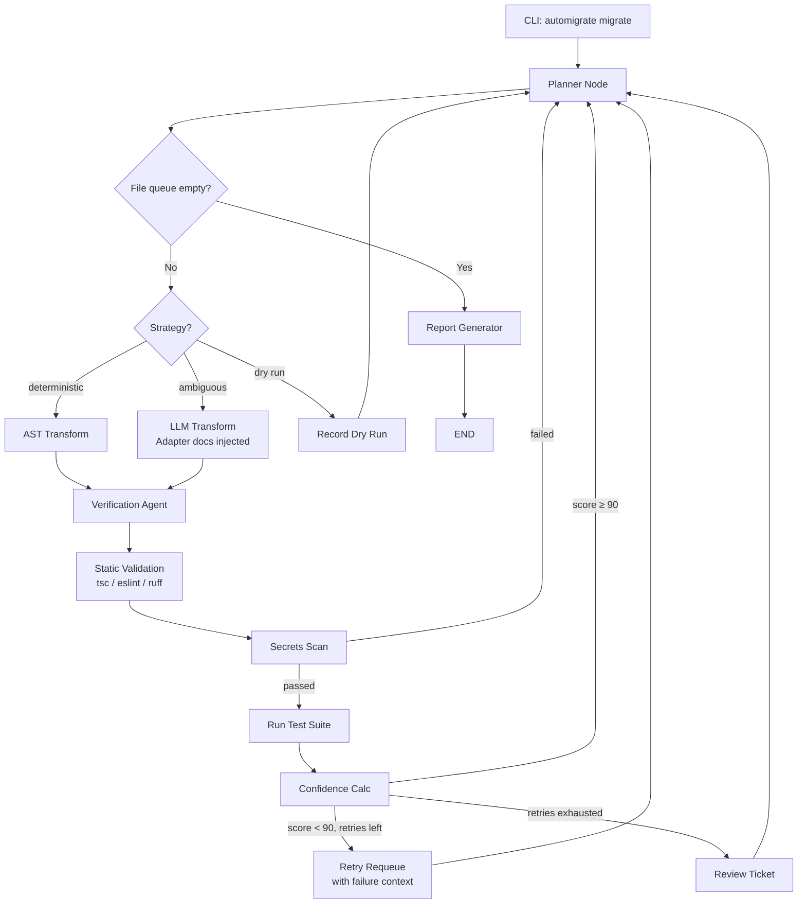

# Reforge — Universal Agentic Framework Migration System

> An autonomous, tool-using AI agent that detects your framework, fetches the right migration documentation, and migrates your codebase across framework versions — validating every change through a multi-stage verification pipeline and escalating only what it isn't confident about.

---

## What It Does

Every major framework release introduces breaking or recommended syntax changes — Angular's `*ngIf`/`*ngFor` → `@if`/`@for`, React class components → Hooks, Vue 2 → 3, Next.js Pages Router → App Router, and so on. Teams handle this by dedicating engineers to manually rewrite affected files, run tests after each batch, and review every diff regardless of how trivial or risky it is.

**Reforge automates that workflow end-to-end:**

1. **Detects** the framework automatically from project files (no config required)
2. **Scans** the codebase and classifies every pattern as deterministic (rule-based) or ambiguous (needs LLM)
3. **Transforms** deterministic patterns with fast, reliable regex/AST rules
4. **Falls back to LLM** for ambiguous cases, grounded with bundled migration documentation
5. **Validates** every change — AST syntax, type check, lint, secrets scan, then real test suite
6. **Retries** failed transforms with targeted failure context so the LLM doesn't repeat the same mistake
7. **Escalates** only what genuinely needs a human, with a markdown review ticket
8. **Reports** every run with a machine-readable `report.json` and human-readable `report.md`

---

## Why This Isn't "Just a Codemod"

Codemods are excellent at rule-based syntax rewrites but cannot reason about behavior-changing edge cases, decide which files need special handling, or judge whether a transform actually succeeded. **Reforge treats codemods as tools, not the system** — the intelligence lives in the agent that decides *when* to use them, *what* to do when they don't apply, and *whether* to trust the result.

| Capability | Codemod Alone | Reforge |
|---|:---:|:---:|
| Executes deterministic syntax transforms | ✅ | ✅ |
| Auto-detects framework from project files | ❌ | ✅ |
| Handles ambiguous / semantic cases | ❌ | ✅ LLM fallback |
| Grounds LLM in current migration docs | ❌ | ✅ bundled RAG docs |
| Verifies output before testing | ❌ | ✅ Verification Agent |
| Type-checks and lints the result | ❌ | ✅ tsc, eslint |
| Scans for leaked credentials | ❌ | ✅ Secrets scan gate |
| Validates via real project tests | ❌ | ✅ ng test / npm test |
| Classifies failures and retries smart | ❌ | ✅ failure-aware retry |
| Human review only where needed | ❌ | ✅ confidence-based routing |
| Pluggable for any framework | ❌ | ✅ adapter plugin system |

---

## Current Status

### ✅ Fully Built & Working

#### Framework Adapter Plugin System
The core architectural achievement. Every piece of framework-specific knowledge (file patterns, rules, docs, prompts, validators, test commands, failure hints) lives in a self-contained adapter. The agent pipeline itself is 100% framework-agnostic.

```
automigrate/adapters/
├── base.py              ← FrameworkAdapter ABC (the plugin contract)
├── registry.py          ← detect_framework(), get_adapter(), list_adapters()
├── angular/
│   ├── adapter.py       ← AngularAdapter — full implementation
│   └── docs/
│       ├── control_flow.md           ← bundled RAG docs
│       └── standalone_components.md
└── react/
    ├── adapter.py       ← ReactAdapter — LLM-only path, ready to use
    └── docs/
        └── class_to_hooks.md         ← bundled RAG docs
```

**Adding a new framework = 2 steps:**
1. Create `adapters/<framework>/adapter.py` implementing `FrameworkAdapter`
2. Add it to `registry.py`'s `_load_adapters()` list

#### Agent Pipeline (LangGraph)
Full stateful agent graph with conditional routing, retry logic, and report generation:

```
Planner → [deterministic: AST transform] → Verification → Static Validation
        → [ambiguous:    LLM transform]  →   (tsc/eslint) → Secrets Scan
                                                         → Run Tests → Confidence Calc
                                                         → [pass] → next file
                                                         → [fail, retries left] → retry with failure context
                                                         → [fail, budget exhausted] → Review Ticket
                                                         → Report Generator
```

#### CLI
```bash
automigrate list-frameworks                              # show all adapters and migrations
automigrate scan    ./my-project                        # auto-detect + classify
automigrate dry-run ./my-project                        # plan without writing
automigrate migrate ./my-project                        # full migration run
automigrate migrate ./my-project --framework react      # explicit framework
automigrate migrate ./my-project --framework angular --migration standalone_components
automigrate transform ./file.html --diff-only           # single file, diff only
automigrate report ./reports/run_2026_08_27_2133        # re-render a past run
automigrate rollback ./my-project                       # restore from .bak files
```

#### Angular Adapter — Production Ready
- **Migrations:** `control_flow` (default), `standalone_components`
- **Detection:** package.json `@angular/core`, `angular.json`, `.angular/` dir, or HTML files containing `*ngIf`/`*ngFor` (works for bare fixture directories too)
- **Deterministic rules:** `ngif_simple`, `ngif_else`, `ngif_then_else`, `ngfor_simple`, `ngfor_trackby`, `ngfor_locals`, `ngswitch`
- **Ambiguous:** `ngif_async_pipe` → routes to LLM with bundled docs
- **Validators:** tsc `--noEmit`, eslint
- **Test command:** `ng test --watch=false` → `npm test` fallback

#### React Adapter — Scaffold Ready
- **Migrations:** `class_to_hooks` (default), `cra_to_vite`, `router_v5_to_v6`
- **Detection:** `react` in package.json (excludes Angular projects)
- **Rules:** empty registry (all patterns go through LLM) — deterministic rules to be added
- **LLM path:** rich system prompt + few-shot examples for each migration type
- **Bundled docs:** comprehensive React Hooks migration guide
- **Test command:** auto-detected from package.json scripts

#### RAG (Context Stuffing)
Each adapter bundles its own migration documentation. The LLM transform node loads the right docs based on `framework + migration_type` from state — no vector DB setup required for the current doc sizes.

#### Validation Pipeline
- **Verification Agent:** rule-based checks for leftover legacy directives, unbalanced braces, orphaned `ng-template` refs
- **Static Validation:** adapter-provided validators (tsc, eslint) via `get_static_validators()`
- **Secrets Scan:** pattern-based credential detection (gating — failure blocks regardless of other scores)
- **Test Runner:** adapter's `get_test_command()` with heuristic fallback

#### Confidence Scoring
Observable signals → numeric score → routing decision:

| Signal | Points |
|---|---:|
| Deterministic AST transform used | +40 |
| AST/syntax check passed | +10 |
| Type check passed | +15 |
| Lint passed | +10 |
| Test suite passed | +20 |
| Verification agent passed | +5 |

- **≥ 90** → Auto-approved
- **< 90** → Retry (up to `--max-retries`, default 3)
- **Retries exhausted** → Review ticket + escalated

#### Failure-Aware Retry
Failures are classified (`syntax_failure`, `type_error`, `lint_error`, `test_failure`, `secrets_detected`, `unknown`) and the retry prompt is enriched with framework-specific correction hints from the adapter — so the LLM doesn't repeat the same mistake.

#### Output
```
reports/run_2026_08_27_2133/
├── report.json      ← canonical machine-readable (CI-gatable)
├── report.md        ← human-readable rendering (derived, never separate)
└── review/
    └── REVIEW_<file>.md   ← one ticket per escalated file
```

#### Test Suite
57 tests, all passing:
```bash
pytest tests/ -v   # ~4s
```
Covers: adapter registry, auto-detection, Angular/React adapter contracts, generic rule engine, agent routing, confidence calculator, report generation.

---

### 🔨 Partially Built / Known Gaps

| Area | Status | Notes |
|---|---|---|
| React deterministic rules | Scaffold only | All React patterns currently go through LLM. Regex/jscodeshift rules for common patterns (setState → useState, componentDidMount → useEffect) not yet written |
| Vue 3 adapter | Not started | Architecture is ready, just needs a new adapter |
| Next.js adapter | Not started | Pages Router → App Router migration would be high-value |
| Real vector RAG | Not wired | `retriever.py` exists and `chromadb`/`sentence-transformers` are in deps, but retrieval is context-stuffing only (full doc loaded). Chunking + embedding + reranking not active |
| LangSmith tracing | Not wired | Infra is in deps (`langsmith`) but traces aren't emitted yet |
| Parallel file processing | Not implemented | LangGraph `Send` fan-out for independent files is designed but not built |
| GitHub Issue tickets | Not implemented | `create_review_ticket` writes markdown locally only |
| `standalone_components` rules | Docs bundled only | No deterministic rules yet — all LLM |

---

## How It Works

### System Architecture

```
Human runs: automigrate migrate ./my-project
                        │
                        ▼
              CLI boots LangGraph agent
                        │
              ┌─────────▼──────────┐
              │   Framework Detect  │  ← reads package.json, angular.json, etc.
              │   (or --framework)  │
              └─────────┬──────────┘
                        │
              ┌─────────▼──────────┐
              │  FrameworkAdapter   │  ← provides rules, docs, prompts, validators
              └─────────┬──────────┘
                        │
         ┌──────────────▼──────────────┐
         │    LangGraph Agent Loop      │
         │  planner → transform →       │
         │  verify → validate → test    │
         │  → confidence → retry/done   │
         └──────────────┬──────────────┘
                        │
              ┌─────────▼──────────┐
              │  report.json / .md  │
              │  review tickets     │
              └─────────────────────┘
```

### Agent Graph



---

## Installation & Quick Start

```bash
# Clone and install
git clone https://github.com/Mihir205/Reforge.git
cd Reforge
pip install -e .

# (Optional) Start Ollama for LLM transforms
ollama pull qwen2.5-coder:7b
ollama serve

# Copy env template
cp .env.example .env
```

```bash
# See all supported frameworks and migrations
automigrate list-frameworks

# Auto-detect framework and scan (no writes)
automigrate scan ./my-project

# Full migration — framework auto-detected from package.json / angular.json / etc.
automigrate migrate ./my-project

# Explicit framework + migration type
automigrate migrate ./my-project --framework angular --migration control_flow
automigrate migrate ./my-react-app --framework react --migration class_to_hooks

# Dry run — plan only, no file writes
automigrate dry-run ./my-project

# Re-render a past run's report
automigrate report ./reports/run_2026_08_27_2133

# Rollback (restores .bak files created during migration)
automigrate rollback ./my-project
```

### Environment Variables

| Variable | Default | Purpose |
|---|---|---|
| `OLLAMA_MODEL` | `qwen2.5-coder:7b` | LLM model for ambiguous transforms |
| `OLLAMA_BASE_URL` | `http://127.0.0.1:11434` | Ollama server URL |
| `CONFIDENCE_AUTO_APPROVE_THRESHOLD` | `90.0` | Score above which transforms are auto-approved |
| `CONFIDENCE_QUICK_REVIEW_THRESHOLD` | `70.0` | Score below which human review is flagged |

---

## Project Structure (Actual)

```
automigrate/
├── adapters/                        ← Framework plugin system
│   ├── base.py                      ← FrameworkAdapter ABC
│   ├── registry.py                  ← detect_framework(), get_adapter()
│   ├── angular/
│   │   ├── adapter.py               ← Full Angular adapter
│   │   └── docs/
│   │       ├── control_flow.md
│   │       └── standalone_components.md
│   └── react/
│       ├── adapter.py               ← React adapter (LLM-only path)
│       └── docs/
│           └── class_to_hooks.md
├── agent/
│   ├── graph.py                     ← LangGraph state graph
│   ├── state.py                     ← MigrationState TypedDict
│   └── nodes/
│       ├── planner.py               ← Brain: queue management, retry classification
│       ├── llm_transform.py         ← LLM node (framework-agnostic)
│       ├── confidence_calculator.py ← Scoring
│       └── report_generator.py      ← report.json + report.md writer
├── mcp_server/
│   ├── server.py                    ← MCP server (agent's internal tool interface)
│   └── tools/
│       ├── scan_project.py          ← Walks project, classifies patterns via adapter
│       ├── apply_ast_transform.py   ← Deterministic transforms (engine-agnostic)
│       ├── verification_agent.py    ← Rule-based post-transform checks
│       ├── static_validation.py     ← Framework-aware tsc/eslint/ruff
│       ├── secrets_scan.py          ← Credential detection gate
│       ├── run_test_suite.py        ← Runs ng test / npm test / pytest
│       └── create_review_ticket.py  ← Writes markdown review tickets
├── transforms/
│   ├── base_rules.py                ← Generic TransformRule, RuleRegistry (shared)
│   └── angular_control_flow/
│       └── rules.py                 ← Angular-specific regex transform rules
├── rag/
│   ├── retriever.py                 ← Framework-aware doc loader (adapter-backed)
│   └── ingest.py                    ← Debug/inspection utility
├── eval/                            ← LangSmith + Ragas (scaffolded, not wired)
├── fixtures/
│   └── angular-demo/               ← Test fixture with old *ngIf/*ngFor syntax
├── reports/                         ← Migration run outputs
├── tests/
│   ├── test_adapter_registry.py     ← Adapter system (37 tests)
│   ├── test_phase1.py               ← Angular rules + scan (14 tests)
│   ├── test_phase2.py               ← Agent routing (2 tests)
│   └── test_phase4.py               ← Confidence + report gen (2 tests)
└── cli.py                           ← CLI entry point (console-script)
```

---

## Architecture Principle: CLI vs MCP

A common point of confusion — **these are two different layers for two different consumers:**

- **CLI = the human's entry point.** You run `automigrate migrate` in your terminal. This is the only interface a human ever touches.
- **MCP Server = the agent's internal tool interface.** The LangGraph planner calls `scan_project`, `apply_ast_transform`, `run_test_suite` etc. as MCP tools internally. A human never calls the MCP server directly.

This separation means the full agent can also be exposed as a single composable MCP tool for other AI hosts (Claude Code, Claude Desktop, etc.) — they just call `run_migration(project_path)` and the whole pipeline runs inside their workflow.

---

## Future Improvements

### High Priority

#### 1. Real Vector RAG with Reranking
The current RAG implementation loads the full docs file into the prompt (context stuffing). For large doc sets or when adding many migrations this won't scale. The infra is already in `pyproject.toml`:
- Chunk docs into segments → embed with `sentence-transformers`
- Store in ChromaDB
- Retrieve top-k by similarity → re-rank with `BAAI/bge-reranker-v2-m3`
- Only inject the top-reranked chunks into the prompt

**Impact:** Better LLM accuracy on ambiguous transforms, lower token cost, scales to large doc sets.

#### 2. React Deterministic Rules
The React adapter currently routes all patterns through the LLM. Common class-to-hooks patterns are mechanical enough for regex/AST rules:
- `this.state = { x }` → `const [x, setX] = useState()`
- `componentDidMount() {}` → `useEffect(() => {}, [])`
- `this.setState({ x: val })` → `setX(val)`
- `createRef()` → `useRef(null)`

**Impact:** Faster, cheaper, more reliable transforms for simple React components.

#### 3. Vue 3 Adapter
Options API → Composition API is a high-demand migration with clear mechanical rules. The adapter system is ready — just needs:
- Detection: `vue` in `package.json` + `.vue` files
- Rules: `data()` → `ref()`/`reactive()`, `methods:` → plain functions, `computed:` → `computed()`, lifecycle hooks → Composition API equivalents
- Bundled Vue 3 migration docs

#### 4. Next.js Adapter
Pages Router → App Router migration is one of the most requested and complex JS migrations:
- `pages/` → `app/` directory structure
- `getServerSideProps` → async Server Components
- `getStaticProps` → `fetch()` with `cache: 'force-cache'`
- Client component boundary (`'use client'`) detection

#### 5. LangSmith Tracing
`langsmith` is already in dependencies but traces aren't emitted. Wiring this up would give:
- Full step-by-step replay of any failed migration run
- Per-node latency and token usage
- Easy debugging without reading raw logs

### Medium Priority

#### 6. Parallel File Processing (LangGraph Fan-out)
Currently files are processed sequentially. LangGraph's `Send` mechanism allows independent files to be dispatched to parallel branches and results aggregated at a join node. No external orchestration needed — just a topology change in `graph.py`.

**Impact:** Significant speed improvement for large projects.

#### 7. GitHub / Jira Issue Integration for Review Tickets
`create_review_ticket` currently writes markdown files locally. Connecting it to the GitHub Issues API (or Jira) would put the human-in-the-loop step somewhere reviewers actually look, with the diff, confidence score, and failure reason attached.

#### 8. Evaluation Metrics Suite
- Automatic Migration Rate (% files auto-approved)
- Human Review Rate
- Retry Success Rate
- False Confidence Rate (auto-approved files that needed a later fix)
- Retrieval Quality (Ragas faithfulness / context relevance, pre/post reranker)
- Time Saved vs Manual Baseline

#### 9. Python Adapter
For Python codebase migrations:
- `unittest` → `pytest`
- Python 2 → 3 syntax
- Flask → FastAPI
- Django version upgrades
- Detection: `requirements.txt` / `pyproject.toml`

### Lower Priority

#### 10. Dependency-Aware Migration Order
Before migrating, build a dependency graph across target files so files are migrated in a safe order (dependencies before dependents). Prevents cascading failures from out-of-order transforms.

#### 11. CI/CD Integration
- GitHub Actions workflow that runs `automigrate dry-run` on PRs and comments the scan results
- Gate merges on `automigrate report` output (e.g., fail if any files are escalated)

#### 12. Web UI / Dashboard
A simple dashboard to visualize migration runs — file-by-file confidence scores, diff viewer, review queue — instead of reading report.md files directly.

#### 13. Incremental Migration
Support for migrating only files changed since a given git commit (instead of the whole project each time). Useful for large codebases where you migrate incrementally per PR.

---

## Development Phases (Retrospective)

### ✅ Phase 1 — Foundations
- Angular `*ngIf`/`*ngFor`/`*ngSwitch` → `@if`/`@for`/`@switch` deterministic rules
- MCP server with `scan_project`, `apply_ast_transform`, `verification_agent`, `static_validation`, `secrets_scan`, `run_test_suite`, `create_review_ticket`
- CLI skeleton (`migrate`, `dry-run`, `scan`, `transform`, `report`, `rollback`)

### ✅ Phase 2 — Agentic Orchestration
- LangGraph state graph with full conditional routing
- Planner node with queue management and dry-run mode
- Retry budget + requeue logic
- Confidence calculator + confidence-based routing

### ✅ Phase 3 — LLM Fallback + RAG
- LLM transformation node using Ollama (qwen2.5-coder)
- Context-stuffing RAG (full doc → LLM prompt)
- Verification agent + secrets scan gate
- Failure-aware retry with targeted correction prompts

### ✅ Phase 4 — Confidence, Reporting, Failure Classification
- Confidence scoring (observable signals → numeric score)
- `report.json` + `report.md` output
- Per-file review tickets (`create_review_ticket`)
- Failure classifier → targeted retry prompts per category

### ✅ Phase 5 — Universal Framework Architecture
- `FrameworkAdapter` abstract base class (plugin interface)
- Adapter registry with auto-detection from project files
- `AngularAdapter` — full implementation wrapping existing rules
- `ReactAdapter` — scaffold with `class_to_hooks`, `cra_to_vite`, `router_v5_to_v6`
- Framework-aware `scan_project`, `static_validation`, `run_test_suite`, `llm_transform`
- CLI `list-frameworks` command
- 4-signal Angular auto-detection (package.json, angular.json, .angular/, HTML directives)
- 37 new adapter tests, 57 total passing

### 🔜 Phase 6 — Improvements (In Progress)
- Real vector RAG + reranking
- React deterministic rules
- Vue 3 / Next.js adapters
- LangSmith tracing
- Parallel file processing

---

## Disclaimer

Reforge is a portfolio/learning project demonstrating agentic AI orchestration (LangGraph + MCP + RAG + plugin adapters) applied to code migration. The Angular control-flow migration is production-quality. The React adapter is a working scaffold. Vue/Next.js adapters are not yet implemented. Vector RAG, LangSmith tracing, and parallel execution are scaffolded but not active.