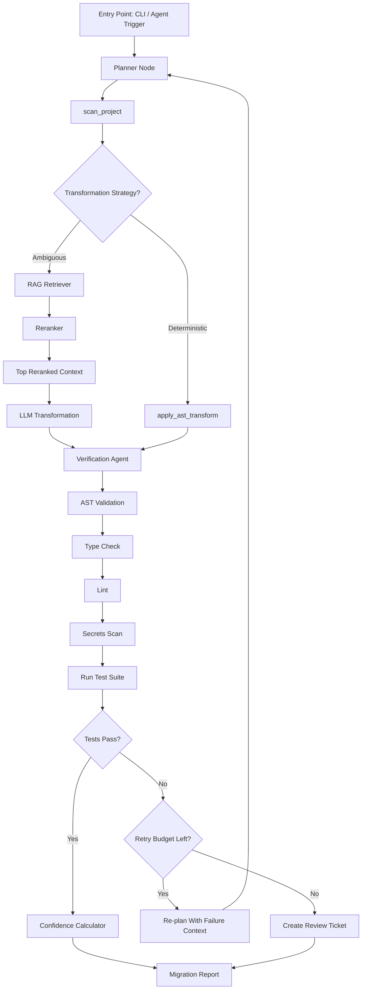

# AutoMigrate — Agentic Framework Migration & Validation System

> An autonomous, tool-using AI agent that migrates codebases across framework versions (e.g., Angular's Control Flow syntax), validates every change through a multi-stage verification pipeline, and escalates only what it isn't confident about — instead of a human doing it all by hand.

---

## 1. Problem Statement

Every major framework release introduces breaking or recommended syntax changes (Angular's `*ngIf`/`*ngFor` → `@if`/`@for`, React class components → hooks, Vue 2 → 3, etc.). Today, teams handle this by dedicating engineers to manually rewrite affected files, running the test suite by hand after each batch, and reviewing every diff regardless of how trivial or risky it is.

This project automates that workflow end-to-end using an **agentic AI system**: a LangGraph-orchestrated agent that plans the migration, uses deterministic AST transforms where possible, falls back to an LLM (grounded via reranked RAG retrieval) for ambiguous cases, verifies its own output through static validation and secrets scanning, and only involves a human where the confidence signals say it should.

---

## 2. Design Principles

- Prefer deterministic AST transformations whenever possible.
- Invoke an LLM only for ambiguous or semantic cases.
- Ground every LLM decision using retrieved, reranked documentation.
- Validate every transformation before accepting it — structurally, behaviorally, and for security.
- Escalate uncertain cases instead of guessing.
- Keep humans in the loop only where they provide value.
- Make every agent decision traceable and replayable.

---

## 3. Why This Isn't "Just a Codemod"

Deterministic AST transforms (via ast-grep, jscodeshift, ts-morph, or similar) are excellent at rule-based syntax rewrites but cannot reason about behavior-changing edge cases, decide which files need special handling, or judge whether a transform actually succeeded. This project treats AST transforms as **tools**, not the system itself — the intelligence lives in the agent that decides *when* to use them, *what* to do when they don't apply, and *whether* to trust the result.

| | Deterministic AST Transform Alone | AutoMigrate (This Project) |
|---|---|---|
| Executes syntax transforms | Yes | Yes (via MCP tool) |
| Handles ambiguous/semantic cases | No | Yes (LLM fallback node) |
| Grounds decisions in current docs | No | Yes (RAG retrieval + reranking) |
| Verifies output before testing | No | Yes (Verification Agent + Static Validation) |
| Scans for leaked credentials | No | Yes (Secrets Scanning Gate) |
| Validates output via real tests | No | Yes (test-runner node) |
| Classifies failures and recovers | No | Yes (failure-aware retry) |
| Human review only where needed | No (all-or-nothing) | Yes (confidence-based routing) |
| Traceable/replayable decisions | No | Yes (tracing layer) |

Note: the transform engine underneath (`apply_ast_transform`) is implementation-agnostic — ast-grep, jscodeshift, ts-morph, or a custom engine can sit behind it without changing the orchestration layer above.

---

## 4. Tech Stack & Core Concepts

| Layer | Technology | Role |
|---|---|---|
| Orchestration | **LangGraph** | Stateful agent graph — planning, looping, conditional routing, fan-out for parallel work |
| Tool Interface | **MCP (Model Context Protocol) Server** | Exposes migration primitives as callable tools |
| Deterministic Transforms | ast-grep / jscodeshift / ts-morph | Rule-based AST rewriting, engine-agnostic |
| LLM Reasoning | LangChain + LLM provider | Handles ambiguous transforms, generates fallback code |
| Grounding | **RAG (retrieval-augmented generation)** | Retrieves current migration docs/release notes so the LLM isn't relying on stale training data |
| Reranker | e.g. `BAAI/bge-reranker-v2-m3` | Re-ranks top-k retrieved chunks before prompt injection, mitigating "lost in the middle" |
| Vector Store | Chroma / FAISS | Stores embedded migration guides, release notes, past reviewed fixes |
| Static Validation | Compiler / type-checker / linter | Catches trivial failures before full test execution |
| Verification Agent | Lightweight rule-based checker | Catches missing imports, incomplete transforms, deprecated APIs left in place |
| Secrets Scanning | gitleaks / truffleHog | Catches accidentally introduced or reproduced credentials before commit |
| Validation | Project's own test runner (Jest/Karma/etc.) | Confirms each transform didn't break behavior |
| Tracing & Observability | **LangSmith** | Full run tracing and replay of agent state for debugging failed migrations |
| RAG Evaluation | **Ragas** | Measures retrieval faithfulness and context relevance to catch silent RAG quality regressions |

---

## 5. Overall Project Workflow

This is the core of the system. Everything else in the README supports this loop.



> Every node in this graph emits trace events to LangSmith, so a failed run can be replayed step-by-step rather than debugged from logs alone.

### Step-by-step narrative

1. **Entry Point** — The agent is invoked (CLI command, dry-run flag, or triggered task) with a target project path and a migration type.
2. **Planner Node (LangGraph)** — The brain of the system. Maintains state: file queue, retry counts, confidence scores, dependency order, dry-run flag. Decides what happens next at every step.
3. **`scan_project` (MCP tool)** — Walks the codebase, parses ASTs, and classifies each match as either a known deterministic pattern or an ambiguous case.
4. **Deterministic path** — If a rule-based transform exists, `apply_ast_transform` runs it directly. No LLM call needed — fast, cheap, reliable.
5. **Ambiguous path (RAG-grounded)** — If no fixed rule applies, the **RAG retriever** pulls candidate chunks from indexed migration guides, release notes, RFCs, and prior human-reviewed fixes. A **reranker** then re-scores those candidates so the most relevant context — not just the top-k by raw similarity — is what actually reaches the prompt.
6. **LLM Transformation** — Generates the transform using the reranked context.
7. **Verification Agent** — Before anything is treated as committable, a lightweight check catches obvious problems: malformed syntax, missing imports, incomplete transformations, deprecated APIs still present, inconsistent formatting, suspicious semantic changes.
8. **Static Validation (AST → compile → type-check → lint)** — Only code that survives this stage proceeds further. This is what keeps the pipeline fast — most trivial failures are caught here instead of burning a full test run.
9. **Secrets Scanning Gate** — Runs after static validation, before tests: catches credentials the LLM may have hallucinated as placeholders or copied from a fixture/context file.
10. **`run_test_suite` (MCP tool)** — Full behavioral validation against the project's real tests.
11. **Confidence Calculator** — Combines every validation signal into a single score (see Section 7).
12. **Conditional routing** — Pass -> confidence-scored and reported. Fail -> failure is classified, and the planner re-plans with that specific failure context, up to a retry budget. Retries exhausted -> escalated to a human review ticket.
13. **Loop** — The planner pulls the next file (respecting dependency order; independent files fan out in parallel via LangGraph's `Send` mechanism, see Section 10) and repeats until the queue is empty.
14. **Final Report** — A structured summary a human actually reads (see Section 8).

---

## 6. Component Responsibility Matrix

| Component | Type | Responsibility |
|---|---|---|
| Planner Node | LangGraph node | Owns agent state, decides next action, tracks retries/confidence/dependency order/dry-run |
| `scan_project` | MCP tool | AST parsing, pattern classification |
| `apply_ast_transform` | MCP tool | Executes deterministic, engine-agnostic AST transforms |
| RAG Retriever | LangChain retriever | Fetches candidate context for ambiguous cases |
| Reranker | Cross-encoder model (e.g. bge-reranker-v2-m3) | Re-scores retrieved chunks for relevance before prompt injection |
| Vector Store | Chroma/FAISS | Stores embedded docs/release notes/reviewed fixes |
| LLM Transformation Node | LangGraph node | Generates transform for cases with no fixed rule |
| Verification Agent | MCP tool / node | Catches obvious structural issues before validation |
| Static Validation Pipeline | MCP tool | AST parse -> compile -> type-check -> lint |
| Secrets Scanning Gate | MCP tool | Runs gitleaks/truffleHog before a transform is accepted |
| `run_test_suite` | MCP tool | Runs existing tests, returns pass/fail + logs |
| Confidence Calculator | LangGraph node | Aggregates validation signals into a single score |
| `create_review_ticket` | MCP tool | Surfaces low-confidence/failed changes to a human |
| Report Generator | LangGraph terminal node | Compiles final migration summary |
| Tracing Layer (LangSmith) | Observability integration | Records and replays every node's inputs/outputs |
| RAG Evaluator (Ragas) | Offline evaluation | Scores retrieval faithfulness and context relevance |

---

## 7. Confidence Score Calculation

Confidence is derived from observable validation signals rather than an arbitrary LLM self-reported probability.

| Signal | Score |
|---|---:|
| Deterministic AST Transform used | +40 |
| AST Validation Passed | +10 |
| Type Check Passed | +15 |
| Lint Passed | +10 |
| Secrets Scan Passed | +0 (gating, not scored — a failure here blocks regardless of other signals) |
| Test Suite Passed | +20 |
| Verification Agent Passed | +5 |

**Thresholds:**
- **90–100** -> Auto-approved
- **70–89** -> Recommended for quick human review
- **Below 70** -> Human review required
- **Secrets scan failure** -> Always routed to human review, irrespective of score

---

## 8. Final Migration Report

Each run produces a report containing:

- Files transformed
- Transformation strategy used (deterministic vs. LLM-generated)
- Confidence score per file
- Validation status (AST / type-check / lint / secrets scan / test)
- Tests executed
- Retry count and failure category (if any)
- Human review required (yes/no)
- Estimated engineering time saved
- Link to the traced run in LangSmith for replay

---

## 9. Failure-Aware Retry

Retries are driven by failure classification rather than blindly re-invoking the LLM.

**Failure categories:** Syntax Failure, Compilation Failure, Type Error, Lint Error, Secrets Detected, Test Failure, Runtime Failure

The planner selects a recovery strategy based on the detected category — e.g., a type error triggers a different re-prompt than a failing test assertion, and a secrets-detected failure skips retry entirely and routes straight to human review. This keeps retries targeted instead of "try the whole thing again and hope."

---

## 10. Dependency Analysis & Parallel Execution

Before migration begins, the planner constructs a dependency graph across the target files.

**Responsibilities:**
- Detect files that depend on one another
- Determine a safe migration order
- Prevent cascading failures from out-of-order transforms
- Group independent files for parallel execution using LangGraph's native fan-out (`Send`) pattern — dispatching independent files to parallel branches and aggregating results at a join node, without introducing a separate orchestration system

> Scoped as a Phase 5+ extension — see Section 12.

---

## 11. Dry Run Mode

Executes the full planning and analysis pipeline without modifying the project. Outputs: files that would change, planned transformation strategy per file, estimated migration complexity, predicted confidence, and an estimate of how many files will need human review.

Because dry-run reuses the planner and scanning logic directly (just short-circuiting the write/execute step), it's introduced as soon as the planner exists rather than as a late-stage feature — see Phase 2 in Section 12. It's a low-cost, high-trust artifact: showing stakeholders exactly what *would* happen before anything actually changes.

---

## 12. Development Phases

### Phase 1 — Foundations
- Define one target migration (e.g., Angular `*ngIf`/`*ngFor` → `@if`/`@for`)
- Build the MCP server skeleton and expose `scan_project` + `apply_ast_transform` as tools
- Get a deterministic-only pipeline working end-to-end on a small fixture project

### Phase 2 — Agentic Orchestration + Dry Run
- Design the LangGraph state schema (file queue, retry count, confidence, test results, failure category, dry-run flag)
- Implement the planner node and conditional edges (pass/fail/retry/escalate)
- Implement Dry Run Mode alongside the planner (Section 11)
- Wire in static validation (AST/compile/type-check/lint) and `run_test_suite`

### Phase 3 — RAG-Grounded Fallback + Reranking
- Index official migration guides, release notes, RFCs, and past reviewed fixes into a vector store
- Build the retriever, reranker, and LLM transformation node for cases with no deterministic rule
- Add the Verification Agent and Secrets Scanning Gate as pre-acceptance checks
- Confirm reranked retrieval measurably improves fallback transform correctness vs. a no-reranker baseline

### Phase 4 — Confidence, Reporting, Observability & Human-in-the-Loop
- Implement the confidence calculator (Section 7) and `create_review_ticket`
- Build the failure-aware retry classifier (Section 9)
- Integrate LangSmith tracing across all nodes and Ragas for RAG-quality evaluation
- Build the final report generator (Section 8), including a link to the traced run

### Phase 5 — Extensions (Stretch Goals)
- Dependency analysis and LangGraph fan-out parallel execution (Section 10)
- Rollback/checkpointing for repeatedly-failing files
- Full evaluation metrics suite (Section 14)

### Phase 6 — Demo & Polish
- Curate a representative fixture repo with realistic edge cases
- Record a live demo: dry run preview -> agent migrates -> verification catches an issue -> test fails -> agent retries with failure context -> agent escalates a genuinely ambiguous case -> replay the run in LangSmith
- Write up results: % auto-approved, % flagged, time saved vs. manual baseline

---

## 13. Rollback

Every transformation is checkpointed. If validation repeatedly fails for a file, the agent restores only that file rather than reverting the entire migration run.

> Scoped as a Phase 5+ extension — see Section 12.

---

## 14. Evaluation Metrics

- Automatic Migration Rate
- Human Review Rate
- Validation Success Rate (static validation pass rate before tests)
- Secrets Scan Trigger Rate
- Retry Success Rate
- Average Migration Time per File
- False Confidence Rate (auto-approved files that later needed a fix)
- Retrieval Quality (Ragas faithfulness / context relevance scores, pre- and post-reranker)
- Time Saved Compared to Manual Migration

---

## 15. Project Structure (Suggested)

```
automigrate/
├── mcp_server/
│   ├── tools/
│   │   ├── scan_project.py
│   │   ├── apply_ast_transform.py
│   │   ├── verification_agent.py
│   │   ├── static_validation.py
│   │   ├── secrets_scan.py
│   │   ├── run_test_suite.py
│   │   └── create_review_ticket.py
│   └── server.py
├── agent/
│   ├── graph.py                 # LangGraph state graph definition (incl. fan-out for parallel files)
│   ├── state.py                  # Agent state schema
│   └── nodes/
│       ├── planner.py
│       ├── llm_transform.py
│       └── confidence_calculator.py
├── rag/
│   ├── ingest.py                  # Loads migration docs into vector store
│   ├── retriever.py
│   ├── reranker.py
│   └── data/                       # Migration guides, release notes, RFCs
├── transforms/
│   └── angular_control_flow/       # Deterministic transform rules (engine-agnostic)
├── eval/
│   ├── langsmith_config.py         # Tracing setup
│   └── ragas_eval.py                # RAG quality evaluation
├── fixtures/                       # Sample project(s) used for testing/demo
└── reports/                        # Output migration summaries
```

---

## 16. Extensible Transformation Framework

The orchestration layer (planner, RAG grounding, verification, validation, confidence scoring, tracing) is designed to stay unchanged as new transformation plugins are added. Future plugins could target:

- Additional framework upgrades (React class → hooks, Vue 2 → 3)
- Library migrations
- API deprecation fixes
- Security patches
- Automated refactoring
- Coding-standard enforcement
- Legacy code modernization

---

## 17. Disclaimer

This project is a demonstration of agentic AI orchestration (LangGraph + MCP + RAG + reranking + tracing) applied to code migration, built for learning and portfolio purposes. It is scoped to one framework and one migration type for the core deliverable, with dependency analysis/parallel execution and rollback treated as stretch goals rather than core-path claims. It is not intended as a production replacement for enterprise migration tooling.